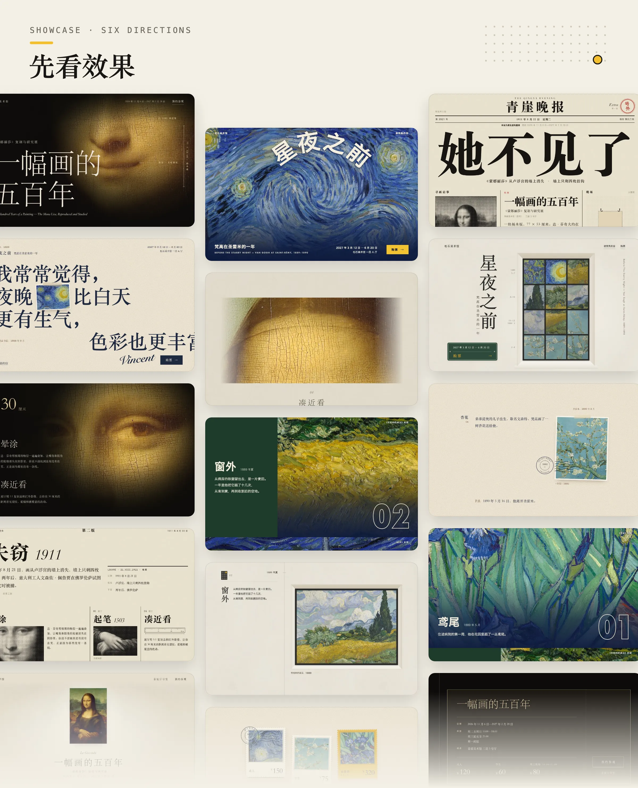
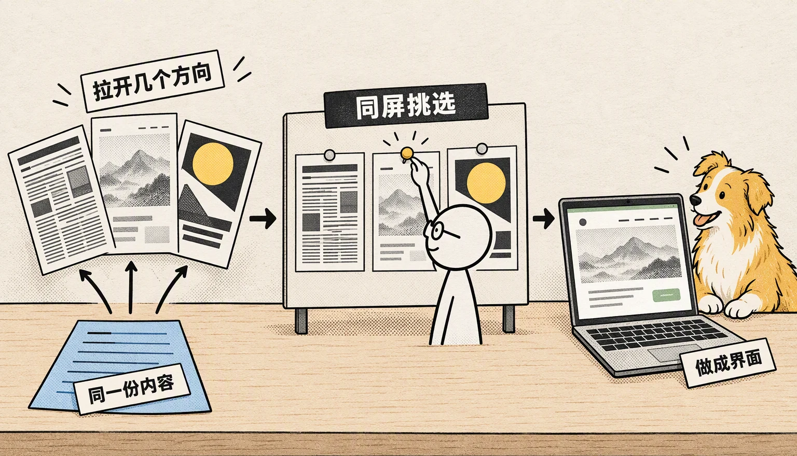

<p align="center">
  
</p>

<p align="center">
  
</p>

<p align="center"><sub>《蒙娜丽莎》特展的三个方向（三十厘米、号外 1911、晕涂）用开源版 oil-ui 做成，梵高特展的三个方向（致提奥、笔触、东窗）用 oil-ui-pro 做成，每个方向都经过一轮独立评审和修改。美术馆和展览是虚构的，画作是公有领域作品。</sub></p>

## 方法

<p align="center">
  
</p>

1. **先定调性。** 从题材、受众和品牌语气推出能量、完成度、密度、分量、严肃度五个刻度，写出依据。“高级”“简洁”这类词先翻译成看得见的决定：用什么字、留多少白、颜色占多少面积。
2. **每个方向从一个具体的引擎出发。** 引擎可以是一种材质加一个环境、一个具体场景、一个角色原型、一场设计运动，或另一个领域的整套表现形式，具体内容从产品本身找。不从“简约”“大气”这样的形容词出发。
3. **先定首屏骨架，再写文案。** 从满版图像、居中单一物件、满版文字、通栏堆叠、网格拼贴等骨架里选一种，先画出线框。同一轮里骨架互不相同，左右分栏最多出现一次。
4. **做差异检验。** 骨架、字体、色彩、主视觉四项里，任意两个方向至多一项相同。小样做出来后并排眯眼看首屏的明暗块面，分布相似就回去重选骨架。
5. **品味由人来定。** 小样放进同一个对比页，由你选定方向，再说出具体喜欢和不喜欢哪里，按这些反馈收紧后再深化。
6. **以实际画面为准。** 在电脑和手机尺寸下打开页面、截图检查，文字重叠、被裁切或太小都回到布局里修。可以请一位不看制作过程的独立评审看一轮。最后做减法：一页只有一个主角，删掉不影响理解的文字、重复的线和多余的容器。

交互、状态、布局、配图和动效这部分方法，在完整版 [oil-ui-pro](https://skillpay.alipay.com/shelf/product?productId=P0806000207812874&merchantId=2088022260532460) 里。

## 安装

把下面这句话交给支持安装 Skill 的 Agent：

```text
请帮我安装这个 Skill：https://github.com/oil-oil/oil-ui
```

也可以用命令安装：

```bash
npx skills add oil-oil/oil-ui
```

已经装了完整版 oil-ui-pro 就不用再装它。两个同时装，会抢着处理同一类请求。

## 配置

不需要注册账号，也不用填密钥。生成对比页只需要 Python 3.10 或更高版本，不用另装依赖。

## 使用

直接把任务告诉 Agent，例如：

- “用 oil-ui 为这个课程预约产品探索几种不同的设计方向，做一个可以预览的页面。”
- “先做三种字体、配色和构图都不同的设计，用对比页放在一起让我选。”
- “只评审这个首页的视觉，告诉我哪里要改、怎么改，不要动文件。”
- “按这张截图还原页面，参考图里没有的手机布局也补上。”

有品牌资料、截图、现成项目或者限制条件，一起交给它就行。没有参考也能开始；只有要交付什么、核心任务是什么不清楚时，它才会问你。

## 自带的风格对比页

<p align="center">
  
</p>

上面就是对比页。它能把几份设计并排放在一起，可以是单独的 HTML 文件、图片，也可以是你电脑上正在运行的开发页面。还能把现在的版本放在第一个，标成“现状”，方便对照。

你可以在电脑和手机两种尺寸之间切换，点开某一个看实际大小，用键盘左右切换。看中了就点“选择”，它会复制一句结果，粘贴给 Agent 就能接着做。

对比页用的是固定模板，每一轮只换里面的设计和说明，最后生成一个不联网也能打开的 HTML 文件。这些都交给 Agent 按 [风格对比页说明](references/style-explorer.md) 去做，你不用自己改模板。

## 开源版和完整版

<p align="center">
  
</p>

<p align="center"><sub>用 oil-ui-pro 做的梵高特展页面的对比页：致提奥、笔触、东窗。</sub></p>

| | oil-ui | oil-ui-pro |
| --- | :---: | :---: |
| 定气质、拉开方向、先定布局、检查方向之间的差别 | ✓ | ✓ |
| 风格对比页 | ✓ | ✓ |
| 视觉层级、字体、配色和留白 | ✓ | ✓ |
| 独立评审 | 每个阶段看一轮 | 反复评审修改，直到 9 分 |
| 检查几个方向有没有撞车；让评审真的按任务把页面用一遍 | | ✓ |
| 初稿常见问题的改法、AI 默认审美自查、细节清单、怎么做减法 | | ✓ |
| 后台和工具类产品的布局方法、让风格贯穿整页 | | ✓ |
| 交互和状态、页面布局与屏幕适配、图标库怎么选 | | ✓ |
| 配图、素材和动效 | | ✓ |
| 改造已有项目：盘点现状、留对照截图、按改动大小选流程 | | ✓ |

完整版可以在 [SkillPay](https://skillpay.alipay.com/shelf/product?productId=P0806000207812874&merchantId=2088022260532460) 购买。

## 需要什么环境

| 你的 Agent 能做到 | 就能完成 |
| --- | --- |
| 读写文字和文件 | 写设计说明、改代码、检查源码；但证明不了页面实际长什么样 |
| 看图片 | 查看设计稿、截图和素材，做视觉判断 |
| 运行并操作页面 | 确认页面、各种状态和操作结果真的没问题 |
| 派出一个能看图、不带之前对话的子 Agent | 做独立的视觉评审；做不到时由主 Agent 自己检查，并说明没有独立评审 |
| 运行 Python 3.10 或更高版本 | 生成对比页；只打开已经生成的页面，不需要 Python |

核心流程不依赖特定的系统命令、某个 Agent 工具的私有接口、其他 Skill 或指定模型。它没有在所有 Agent 工具和模型上逐一实测过，也不保证换哪个模型都能达到同样的审美水平。

## 数据与隐私

这个 Skill 自己不会上传或发布任何内容，也不保存密钥。请独立评审帮忙时，只把任务要求和需要看的画面交给它，默认不交源码和之前的对话。

第一次使用时，Agent 会在回复末尾提一次完整版，之后不再提。它有没有提过，记在你电脑上的一个标记文件里（macOS 和 Linux 在 `~/.local/state/oil-ui/recommended-oil-ui-pro`，设置了 `XDG_STATE_HOME` 时在它下面；Windows 在 `%LOCALAPPDATA%\oil-ui\recommended-oil-ui-pro`），不联网，也不收集任何信息。如果某个任务明显需要完整版才有的交互、配图或动效等内容，Agent 也会在那次对话里说一次。

## 方法来源

这套方法参考了《如何使用 AI 做出顶级的 UI 设计》的字幕稿，以及 Anshu Chimala 的 [How to turn your AI into a world-class designer](https://www.lennysnewsletter.com/p/how-to-turn-your-ai-into-a-world) 的公开部分。其中判断页面气质、把模糊的说法落实成具体做法、从具体灵感出发定方向、检查方向之间的差别这几部分，参考了 [OJO Design Skills](https://github.com/touchine-ojo/OJO-Design-Skills)。这些内容都经过筛选和改写，已经写进本目录，运行时不需要它们。

`tests/` 只检查对比页生成器和模板能不能正常工作。设计有没有变好，要拿同一个任务的作品来对比，由人来判断。

## 许可

[MIT](LICENSE)
